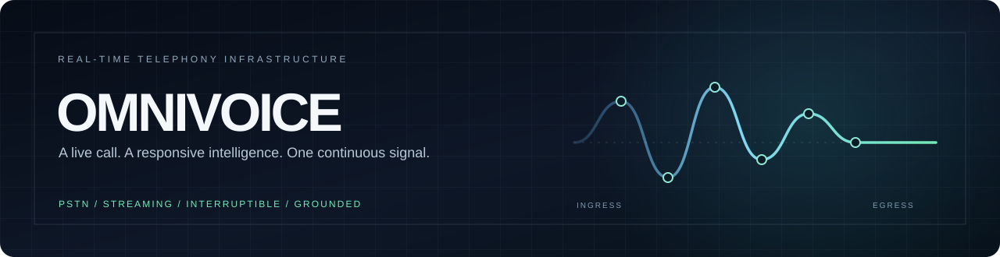
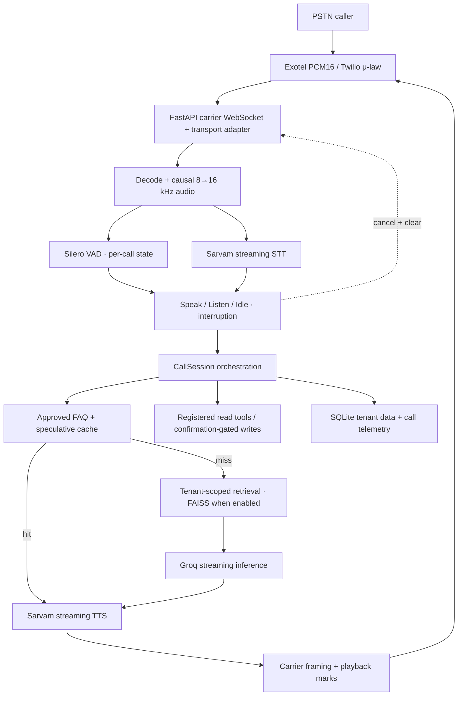
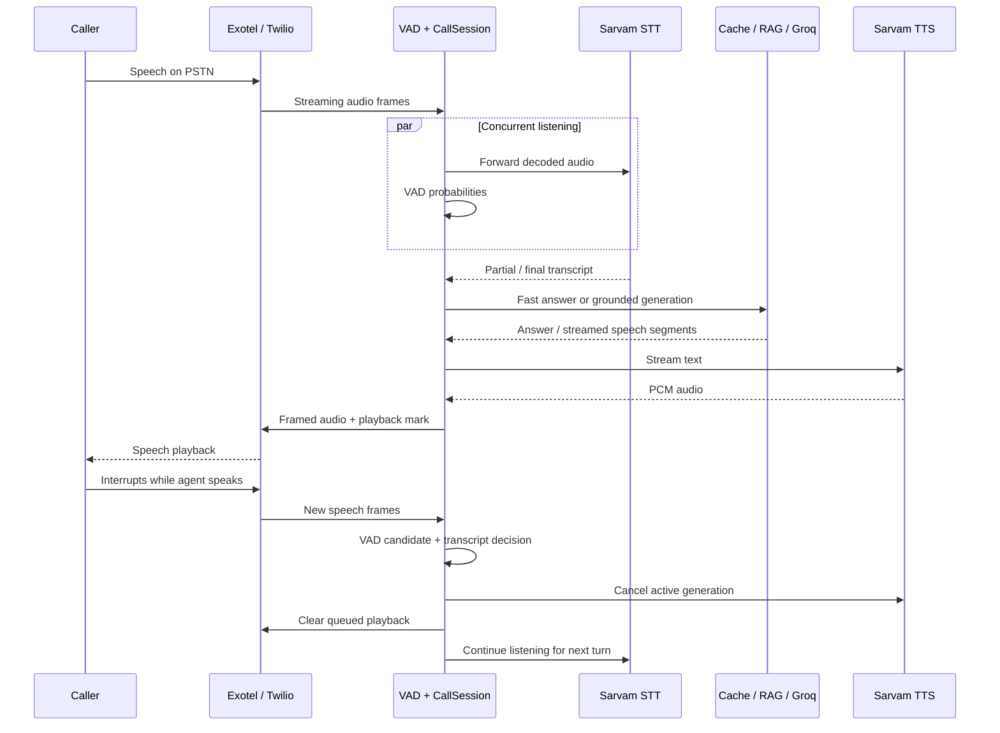

# OmniVoice



### A voice agent infrastructure built for the phone line.

OmniVoice connects live PSTN calls to streaming speech, grounded knowledge, and confirmation-gated enterprise actions through an asynchronous FastAPI media engine. It is a telephony platform with an operations console—not a browser chatbot.

[Product site](https://omnivoice-self.vercel.app/) · [Quick start](#quick-start) · [Architecture](#architecture) · [Evaluation](#performance-and-evaluation) · [Developer guide](docs/DEVELOPER_GUIDE.md)

`Python 3.11` &nbsp; `FastAPI + WebSockets` &nbsp; `Exotel / Twilio adapters` &nbsp; `Sarvam + Groq` &nbsp; `Silero + FAISS`

> [!IMPORTANT]
> **Engineering status, not a production SLA.** Live Exotel handset calls have validated the basic PSTN conversation path. The published 56-turn latency study used a live gateway harness with real Groq and Sarvam providers and a synthetic STT endpoint offset; it was **not** a physical PSTN mouth-to-ear test. Sub-500 ms voice turnaround and sub-50 ms interruption remain product targets. See [current status](docs/PROJECT_STATUS.md) and the [benchmark method](docs/OV006_BENCHMARK_RESULTS.md).

## Why OmniVoice?

A phone conversation cannot wait for a chain of blocking transcription, retrieval, inference, and synthesis requests. It also cannot ignore a caller who interrupts. OmniVoice keeps carrier audio, neural voice detection, speech recognition, retrieval, model generation, and speech output in overlapping asynchronous streams.

| Conventional voice wrapper | OmniVoice's implemented path |
| --- | --- |
| Wait for a complete request before starting each stage | Stream STT, LLM text, and TTS audio across bounded async tasks |
| Query remote knowledge for every answer | Check approved FAQ answers and an optional bounded in-memory semantic cache first; retrieve context on misses |
| Treat noise or every short utterance as a barge-in | Combine per-call Silero VAD with transcript-based backchannel filtering and carrier playback clear |
| Execute a model-proposed business write immediately | Stage registered writes and require playback acknowledgment plus an explicit final-turn confirmation |

## Product preview

The [product site](https://omnivoice-self.vercel.app/) presents the system and an illustrative browser audio experience. The actual caller path is **PSTN/SIP → carrier media WebSocket → OmniVoice**. The embedded [operations console](omnivoice/static/) manages tenants, knowledge, lines, calls, and action activity. No verified console screenshot is committed yet; the signal graphic above is an architectural illustration, not a product screenshot.

<details>
<summary>Explore the call lifecycle</summary>

1. A caller reaches an Exotel or Twilio number connected to OmniVoice.
2. Carrier audio is decoded and fanned out to STT and per-call neural VAD.
3. The session checks for an armed action confirmation, then approved fast answers, then contextual retrieval and streamed inference.
4. Speech segments stream to TTS and are framed for the carrier while the caller can still speak.
5. An accepted interruption cancels the current response and sends a carrier `clear` event; a write never commits from partial speech.

</details>

## Core capabilities

| Area | Implemented today |
| --- | --- |
| **Full-duplex call loop** | Concurrent receive, STT, VAD, response, and playback tasks with bounded queues and a Speak / Listen / Idle state machine. |
| **Barge-in** | Neural speech detection, transcript-based backchannel suppression, response cancellation, and carrier buffer clear. Acoustic stop-at-handset timing remains unmeasured. |
| **Indian-language speech pipeline** | Sarvam streaming STT/TTS and configurable language codes. End-to-end multilingual telephone verification is still planned. |
| **Carrier adapters** | Exotel PCM16 AgentStream path and Twilio G.711 μ-law path. Live handset validation exists for Exotel; Twilio PSTN validation remains open. |
| **Grounded answers** | Exact approved FAQs, optional local semantic embeddings/FAISS cache, foreground retrieval, and Groq token streaming. Background prediction warms likely FAQ topics. |
| **Enterprise actions** | Tenant-registered read/write tools, speculative read calls, staged writes, playback-mark arming, explicit verbal confirmation, and idempotency-key dispatch. |
| **Isolation and observation** | Tenant-scoped API tokens and data access, SQLite WAL, call metrics, a call inspector, benchmark export, and evaluation tooling. |

The [architecture reference](docs/ARCHITECTURE.md) covers codecs, queue ownership, cancellation, cache coherence, and action state transitions.

## Architecture



### A turn can be interrupted



The diagrams show control flow, not measured network timing. Exotel and Twilio use different carrier codecs and frame sizes; [transport details](docs/DEVELOPER_GUIDE.md#media-and-duplex-invariants) distinguish them.

## Tech stack

| Layer | Technology |
| --- | --- |
| Media/API | Python 3.11, FastAPI, asyncio, Uvicorn, WebSockets |
| Speech and turn-taking | Sarvam STT/TTS, Silero ONNX VAD, FlexDuo state machine |
| Reasoning and knowledge | Groq streaming inference, local FAISS, optional FastEmbed multilingual embeddings |
| Data and operations | SQLite WAL, tenant-scoped console, Server-Sent Events |
| Product site | Next.js 16, React 19, Tailwind CSS 4; deployed separately from the voice backend |

## Quick start

On Windows with Python 3.11, install the local Silero model once before starting the service:

```powershell
git clone https://github.com/KevinGeorge100/OMNIVOICE.git
cd OMNIVOICE
py -3.11 -m venv .venv
.\.venv\Scripts\python.exe -m pip install -c requirements.lock -e '.[dev,semantic]'
.\.venv\Scripts\python.exe -m omnivoice.cli models
.\start.ps1
```

The startup script initializes local configuration and serves the API/console at [http://127.0.0.1:8000](http://127.0.0.1:8000); on later runs it can also recreate a missing virtual environment. It does **not** download models, provision carrier numbers, or supply provider credentials. Read the locally generated `.env` to use `OMNI_ADMIN_TOKEN`; never commit or share it.

<details>
<summary>Manual setup and optional semantic models</summary>

```powershell
py -3.11 -m venv .venv
.\.venv\Scripts\python.exe -m pip install -c requirements.lock -e '.[dev,semantic]'
.\.venv\Scripts\python.exe -m omnivoice.cli init
.\.venv\Scripts\python.exe -m omnivoice.cli models --semantic
```

Set `OMNI_SEMANTIC_ENABLED=true` only after installing the embedding model. Without it, approved exact FAQs and lexical document retrieval remain available. Model downloads occur during setup, not application startup.

</details>

## Real telephony setup

| Stage | What you configure |
| --- | --- |
| **Local development** | `OMNI_SARVAM_API_KEY`, `OMNI_GROQ_API_KEY`, local Silero model, enterprise, approved knowledge, and greeting. The browser console is administrative; localhost is not publicly reachable by a carrier. |
| **Exotel** | An existing Exophone with AgentStream enabled, a public HTTPS/WSS origin in `OMNI_PUBLIC_BASE_URL`, and the private stream URL returned by **Connection details** in the Exotel VoiceBot flow. |
| **Twilio** | A configured line, the signed `/telephony/twilio/{line_id}` webhook from **Connection details**, `OMNI_TWILIO_AUTH_TOKEN`, and the resulting bidirectional Media Stream. Live PSTN verification is still pending. |
| **Deployment** | A persistent single-worker backend, durable SQLite volume, TLS/WSS, WebSocket upgrades, secret management, and carrier-specific validation before customer use. |

[Step-by-step setup](docs/DEVELOPER_GUIDE.md#first-live-phone-call) · [Deployment guide](docs/DEPLOYMENT.md)

## Performance and evaluation

| Evidence class | Current statement |
| --- | --- |
| **Target** | Sub-500 ms voice turnaround and sub-50 ms interruption are design goals, not service guarantees. |
| **Measured — live gateway harness** | 56 valid turns across 6 sessions; median server transcript-to-first-outbound-audio was **774.76 ms** overall and **261.12 ms** for the fast-cache subset. Groq and Sarvam calls were live; the STT endpoint used a 120 ms synthetic harness offset. [Method and distributions](docs/OV006_BENCHMARK_RESULTS.md). |
| **Verified separately — PSTN path** | Historical Exotel handset calls demonstrated inbound conversation and barge-in. They did not establish a mouth-to-ear latency distribution. [Validation status](docs/PROJECT_STATUS.md). |
| **Not yet validated** | Physical acoustic mouth-to-ear latency, carrier transit, Twilio PSTN behavior, and a multilingual/noise corpus baseline. |

The server records STT endpoint **proxy**, fast lookup, RAG retrieval, LLM TTFT, speech buffer delay, TTS first audio, carrier framing/send, and first outbound audio timings. Missing stages remain unavailable rather than zero. [Metric definitions and exclusions](docs/LATENCY_EVALUATION.md) · [Corpus/replay contract](docs/EVALUATION.md).

## Security & action safety

Enterprise API tokens are hashed at rest and scoped to a tenant. Registered tool endpoints require public HTTPS addresses; DNS is checked and pinned, redirects are disabled, and the model cannot choose an arbitrary URL or execute uploaded SQL. Speculative tools are read-only. Write proposals are staged, bound to a call and tenant, armed after a playback mark, and committed only after an exact final-turn confirmation; an idempotency key accompanies dispatch. An ambiguous downstream write outcome requires reconciliation rather than an automatic retry. [Action details](docs/DEVELOPER_GUIDE.md#enterprise-action-contract).

This is an MVP security architecture, not a compliance certification. A current known issue is the Exotel stream token in the WSS path, which can appear in proxy logs; see [project status](docs/PROJECT_STATUS.md).

## Repository map

| Path | Purpose |
| --- | --- |
| [`omnivoice/`](omnivoice/) | FastAPI endpoints, media session, providers, VAD, retrieval, actions, storage, and latency telemetry |
| [`omnivoice/static/`](omnivoice/static/) | Embedded operations console |
| [`landing/`](landing/) | Separate customer-facing Next.js product site |
| [`docs/`](docs/) | Architecture, PRD, deployment, evaluation, status, backlog, and ADRs |
| [`tests/`](tests/) | API, dialogue, streaming, tenant, voice continuity, latency, and browser checks |
| [`scripts/`](scripts/) | Release gate, live-gateway benchmark, metric export, and summaries |
| [`.agents/`](.agents/) | Repository development rules and validation skills |

## Status & roadmap

**Implemented:** single-worker telephony MVP, Exotel handset validation, Twilio adapter, full-duplex cancellation, tenant knowledge, confirmation-gated tools, operations console, and server-side latency instrumentation. **Next:** acoustic/PSTN latency measurement, Twilio and multilingual call validation, provider recovery, cloud rollout verification, stronger access control, and distributed persistence. The [backlog](docs/BACKLOG.md) separates completed work from planned work; the [roadmap](docs/ROADMAP.md) describes longer-term phases.

## Documentation

| Start here | Go deeper |
| --- | --- |
| [Developer guide](docs/DEVELOPER_GUIDE.md) · [Current project status](docs/PROJECT_STATUS.md) | [Architecture](docs/ARCHITECTURE.md) · [PRD](docs/PRD.md) · [ADR index](docs/adr/README.md) |
| [Deployment](docs/DEPLOYMENT.md) · [Backlog](docs/BACKLOG.md) | [Latency protocol](docs/LATENCY_EVALUATION.md) · [Benchmark results](docs/OV006_BENCHMARK_RESULTS.md) · [Evaluation contract](docs/EVALUATION.md) |
| [Contributing](CONTRIBUTING.md) · [Definition of done](docs/DEFINITION_OF_DONE.md) | [Roadmap](docs/ROADMAP.md) |

---

**OmniVoice** · Real-time voice infrastructure for the telephone network. Built to be measured, interrupted, and improved.
